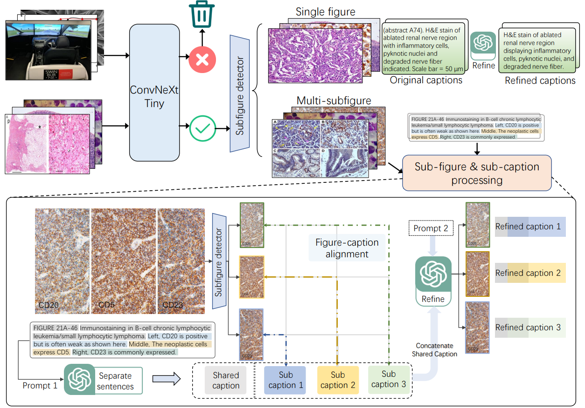
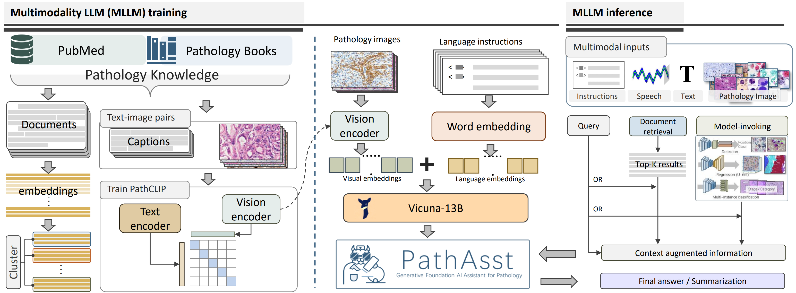
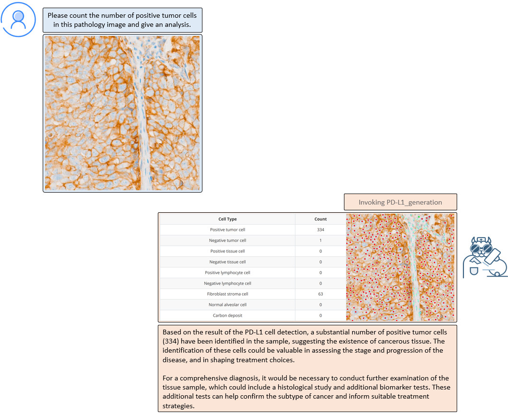

# PathAsst: Generative Foundation AI Assistant for Pathology


<div align=center>  </div>


## Abstract

As advances in large language models (LLMs) and multimodal techniques continue to mature, the development of general-purpose multimodal large language models (MLLMs) has surged, offering significant applications in interpreting natural images. However, the field of pathology has largely remained untapped, particularly in gathering high-quality data and designing comprehensive model frameworks. To bridge the gap in pathology MLLMs, we present PathAsst, a multimodal generative foundation AI assistant to revolutionize diagnostic and predictive analytics in pathology. The development of PathAsst involves three pivotal steps:  data acquisition, CLIP model adaptation, and the training of PathAsst's multimodal generative capabilities. Firstly, we collect over 207K high-quality pathology image-text pairs from authoritative sources. Leveraging the advanced power of ChatGPT, we generate over 180K instruction-following samples. Furthermore, we devise additional instruction-following data specifically tailored for invoking eight pathology-specific sub-models we prepared, allowing the PathAsst to effectively collaborate with these models, enhancing its diagnostic ability. Secondly, by leveraging the collected data, we construct PathCLIP, a pathology-dedicated CLIP, to enhance PathAsst's capabilities in interpreting pathology images. Finally, we integrate PathCLIP with the Vicuna-13b and utilize pathology-specific instruction-tuning data to enhance the multimodal generation capacity of PathAsst and bolster its synergistic interactions with sub-models. The experimental results of PathAsst show the potential of harnessing AI-powered generative foundation model to improve pathology diagnosis and treatment processes.


### Pathology Dataset Construction




### PathAsst network architecture




### Examples




## Usage

- For book's image-text crawling, please refer to [fig_caption_extracter](https://github.com/superjamessyx/Generative-Foundation-AI-Assistant-for-Pathology/tree/main/fig_caption_extracter)  (Readme)

- For sub-figure detection, please refer to [sub-figure_detection](https://github.com/superjamessyx/Generative-Foundation-AI-Assistant-for-Pathology/tree/main/sub-figure_detection) (Readme)
- For pathology image selection, please refer to [pathology_classifier](https://github.com/superjamessyx/Generative-Foundation-AI-Assistant-for-Pathology/tree/main/pathology_classifier) (Readme, model released at [ convnext-pathology-classifier](https://huggingface.co/jamessyx/convnext-pathology-classifier))
- For pathology image caption split&refine, please refer to [pathasst_caption_tool](https://github.com/superjamessyx/Generative-Foundation-AI-Assistant-for-Pathology/tree/main/pathasst_caption_tool) (Readme, model released at [pathasst_caption_tool](https://huggingface.co/jamessyx/pathasst_caption_tool) )
- We have released the PathCap dataset, the dataset can be downloaded from [huggingface](https://huggingface.co/datasets/jamessyx/PathCap)
- We have released the PathCLIP-Base model, the model can be downloaded from [huggingface](https://huggingface.co/jamessyx/pathclip)

 We will continue to open source the following content as soon as possible:

- [x] A trained ConvNext-Tiny model specifically designed for selecting pathology images.

- [x] An annotated 2K bounding box data for subfigure detection, alongside the trained YOLOv7 model.

- [x] Scripts for automated extraction of image-text pairs from PDF books.

- [x] A fine-tuned LLaMA-7B model intended for sub-caption splitting and caption refining.

- [x] A collection of over 200K pathology PubMed image-text pairs.

In addition, we plan to train and release four versions of the CLIP model, which will be fine-tuned using more than 200K pathology samples, including clip-vit-base-patch16, clip-vit-base-patch32, clip-vit-large-patch14, and clip-vit-large-patch14-336.


If you find PathAsst useful for your work, please cite using the following BibTeX:

```bibtex
@misc{sun2023pathasst,
      title={PathAsst: Redefining Pathology through Generative Foundation AI Assistant for Pathology}, 
      author={Yuxuan Sun and Chenglu Zhu and Sunyi Zheng and Kai Zhang and Zhongyi Shui and Xiaoxuan Yu and Yizhi Zhao and Honglin Li and Yunlong Zhang and Ruojia Zhao and Xinheng Lyu and Lin Yang},
      year={2023},
      eprint={2305.15072},
      archivePrefix={arXiv},
      primaryClass={cs.CV}
}
```

